---
## Front matter
title: "Отчёт по прохождению внешнего курса №1"
subtitle: "Основы Кибербезопасности"
author: "Авилов Иван Олегович"

## Generic otions
lang: ru-RU
toc-title: "Содержание"

## Bibliography
bibliography: bib/cite.bib
csl: pandoc/csl/gost-r-7-0-5-2008-numeric.csl

## Pdf output format
toc: true # Table of contents
toc-depth: 2
lof: true # List of figures
lot: true # List of tables
fontsize: 12pt
linestretch: 1.5
papersize: a4
documentclass: scrreprt
## I18n polyglossia
polyglossia-lang:
  name: russian
  options:
	- spelling=modern
	- babelshorthands=true
polyglossia-otherlangs:
  name: english
## I18n babel
babel-lang: russian
babel-otherlangs: english
## Fonts
mainfont: IBM Plex Serif
romanfont: IBM Plex Serif
sansfont: IBM Plex Sans
monofont: IBM Plex Mono
mathfont: STIX Two Math
mainfontoptions: Ligatures=Common,Ligatures=TeX,Scale=0.94
romanfontoptions: Ligatures=Common,Ligatures=TeX,Scale=0.94
sansfontoptions: Ligatures=Common,Ligatures=TeX,Scale=MatchLowercase,Scale=0.94
monofontoptions: Scale=MatchLowercase,Scale=0.94,FakeStretch=0.9
mathfontoptions:
## Biblatex
biblatex: true
biblio-style: "gost-numeric"
biblatexoptions:
  - parentracker=true
  - backend=biber
  - hyperref=auto
  - language=auto
  - autolang=other*
  - citestyle=gost-numeric
## Pandoc-crossref LaTeX customization
figureTitle: "Рис."
tableTitle: "Таблица"
listingTitle: "Листинг"
lofTitle: "Список иллюстраций"
lotTitle: "Список таблиц"
lolTitle: "Листинги"
## Misc options
indent: true
header-includes:
  - \usepackage{indentfirst}
  - \usepackage{float} # keep figures where there are in the text
  - \floatplacement{figure}{H} # keep figures where there are in the text
typora-copy-images-to: ./image
---

# Задание

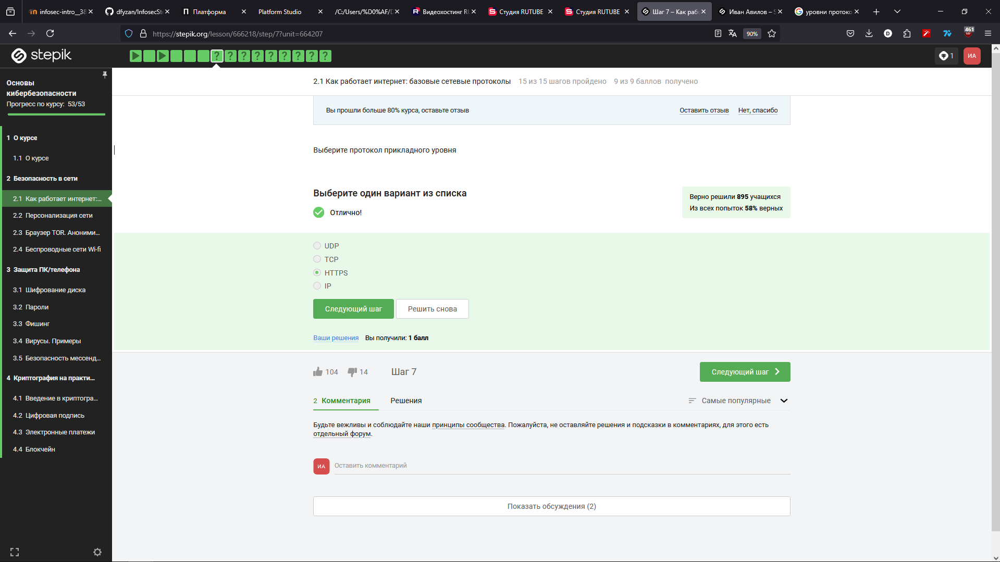

Только HTTPS является протоколом прикладного уровня

TCP является протоколом транспортного уровня

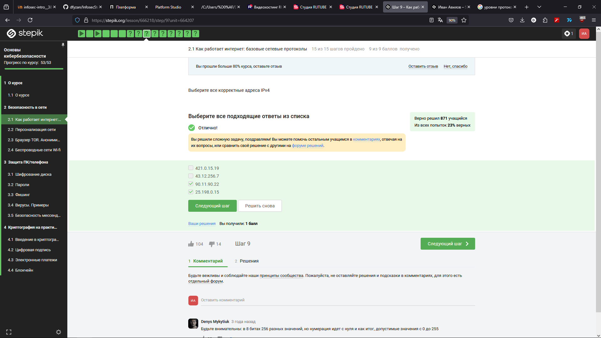

Адреса, в которых есть числа больше 255 - некорректны

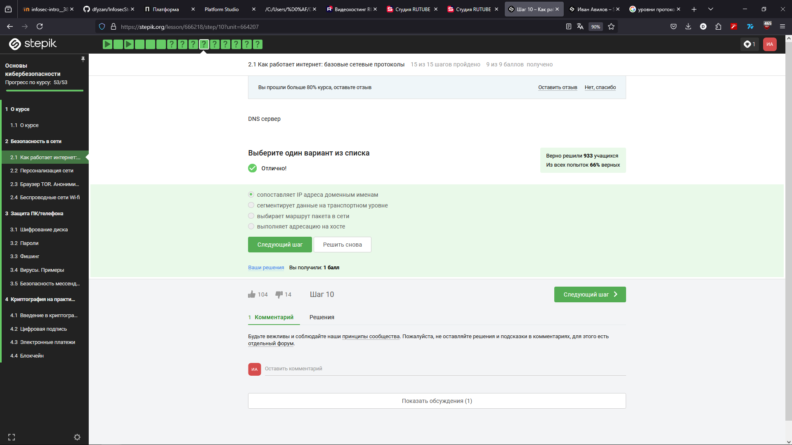

DNS сервера действительно сопоставляют доменное имя с его IP адресом

В верной последовательности протоколы отсортированы от верхнего к нижнему

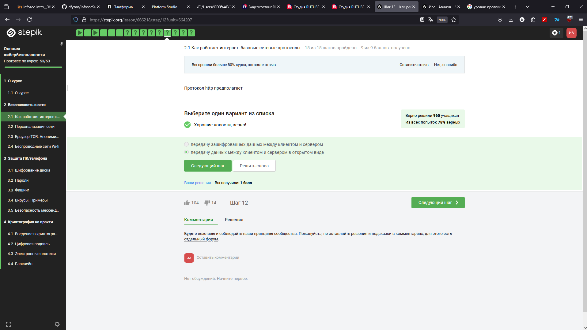

http, в отличии от https не предполагает шифрования

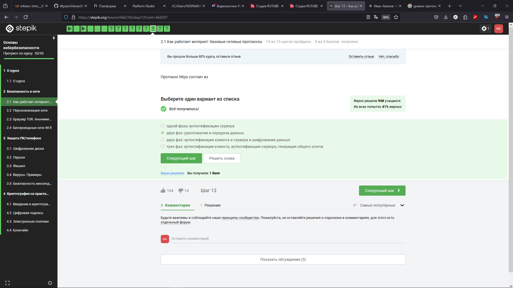

Правильный ответ - 2 фазы, рукопожатие и передача данных

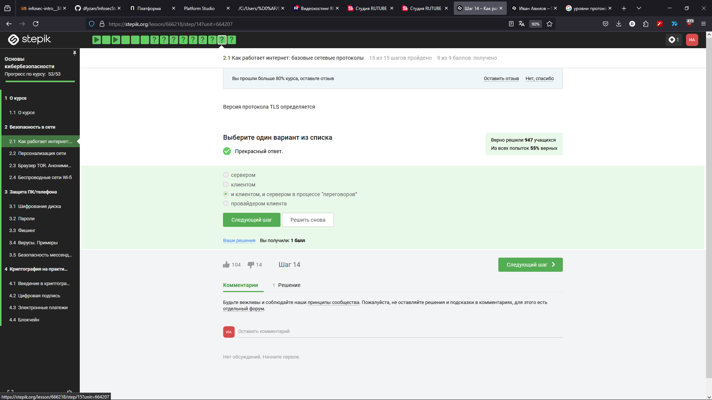

Если у какой-то стороны нету поддержки определённой версии, они договариваются использовать прошлую версию, которая есть у обоих сторон.

Фаза рукопожатия предполагает лишь обмен информацией о способах шифрования: ключах, алгоритмах и т.д. Шифрование данных не выполняется

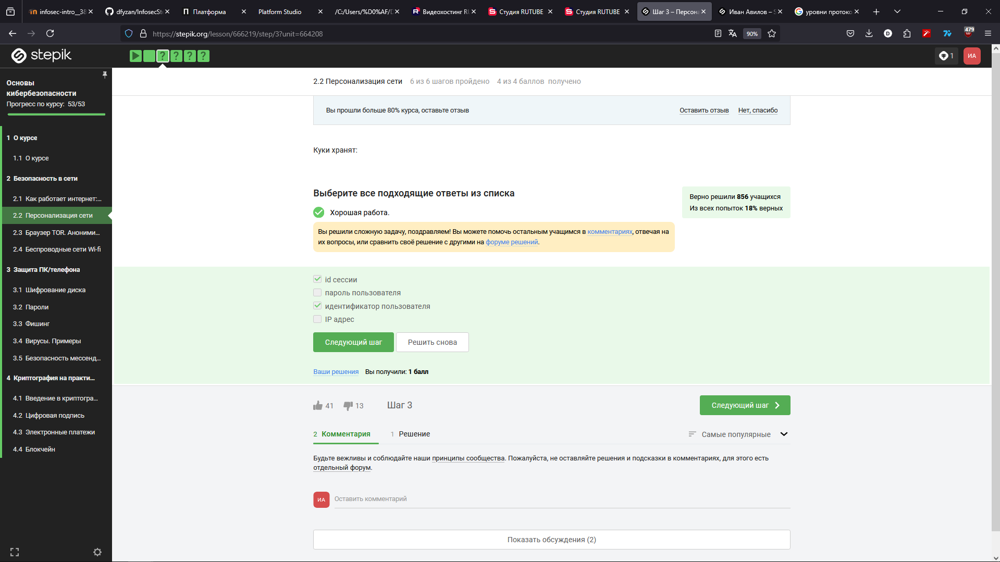

Куки файлы позволяют идентифицировать пользователя, не открывая его персональные данные

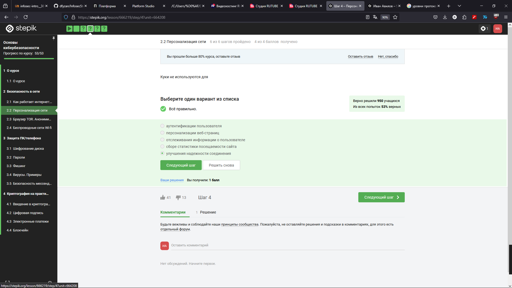

Надёжность соединения - не зона ответственности владельца сайта

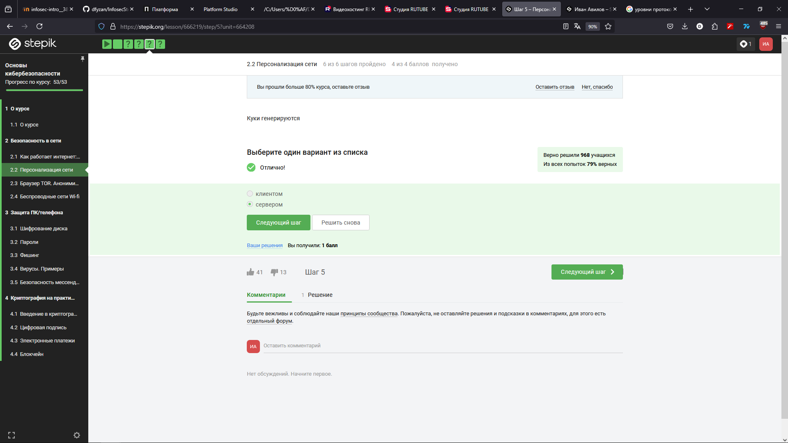

Куки файлы используются и генерируются сервером

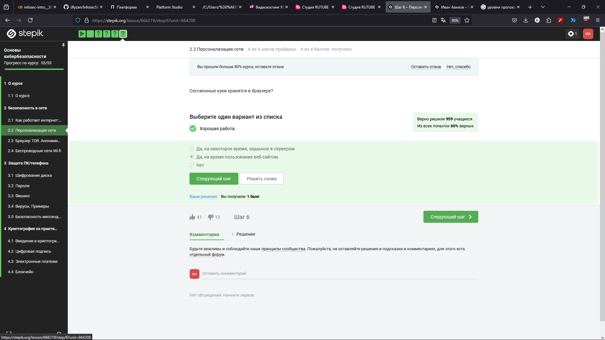

Куки файлы хранятся в браузере на время пользования сайтом

Промежуточных узлов в сети ТОР - 3

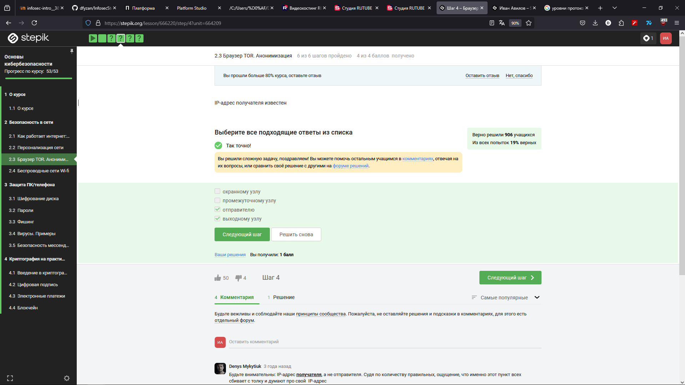

Отправитель должен знать адрес получателя, иначе он не сможет передать его выходному узлу. Выходной узел должен знать адрес получателя, иначе он не будет знать, куда направить пакеты.

Каждый узел знает только свой ключ, которым узел снимает один слой "луковицы"

Нет, так как выходной узел играет роль виртуального пользователя.

Wi-Fi -  технология беспроводной передачи данных в локальной сети

Wi-fi работает на канальном уровне

Самый уязвимый метод - WEP

Шифрование начинается после аутентификации устройств

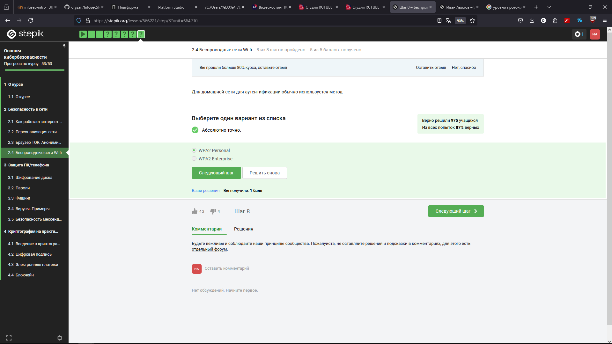

Personal - для личного пользования. Enterprise - для бизнеса
