---
## Front matter
title: "Отчёт по прохождению внешнего курса №2"
subtitle: "Основы Кибербезопасности"
author: "Авилов Иван Олегович"

## Generic otions
lang: ru-RU
toc-title: "Содержание"

## Bibliography
bibliography: bib/cite.bib
csl: pandoc/csl/gost-r-7-0-5-2008-numeric.csl

## Pdf output format
toc: true # Table of contents
toc-depth: 2
lof: true # List of figures
lot: true # List of tables
fontsize: 12pt
linestretch: 1.5
papersize: a4
documentclass: scrreprt
## I18n polyglossia
polyglossia-lang:
  name: russian
  options:
	- spelling=modern
	- babelshorthands=true
polyglossia-otherlangs:
  name: english
## I18n babel
babel-lang: russian
babel-otherlangs: english
## Fonts
mainfont: IBM Plex Serif
romanfont: IBM Plex Serif
sansfont: IBM Plex Sans
monofont: IBM Plex Mono
mathfont: STIX Two Math
mainfontoptions: Ligatures=Common,Ligatures=TeX,Scale=0.94
romanfontoptions: Ligatures=Common,Ligatures=TeX,Scale=0.94
sansfontoptions: Ligatures=Common,Ligatures=TeX,Scale=MatchLowercase,Scale=0.94
monofontoptions: Scale=MatchLowercase,Scale=0.94,FakeStretch=0.9
mathfontoptions:
## Biblatex
biblatex: true
biblio-style: "gost-numeric"
biblatexoptions:
  - parentracker=true
  - backend=biber
  - hyperref=auto
  - language=auto
  - autolang=other*
  - citestyle=gost-numeric
## Pandoc-crossref LaTeX customization
figureTitle: "Рис."
tableTitle: "Таблица"
listingTitle: "Листинг"
lofTitle: "Список иллюстраций"
lotTitle: "Список таблиц"
lolTitle: "Листинги"
## Misc options
indent: true
header-includes:
  - \usepackage{indentfirst}
  - \usepackage{float} # keep figures where there are in the text
  - \floatplacement{figure}{H} # keep figures where there are in the text
typora-copy-images-to: ./images
---

# Задание

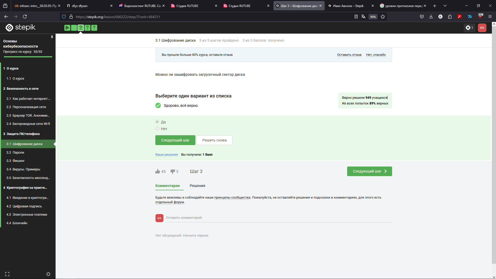

Да, зашифровать загрузочный сектор возможно

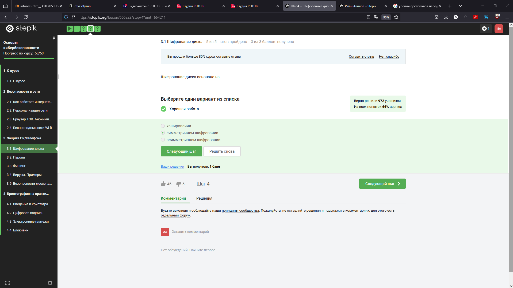

Правильный ответ - симметричное шифрование

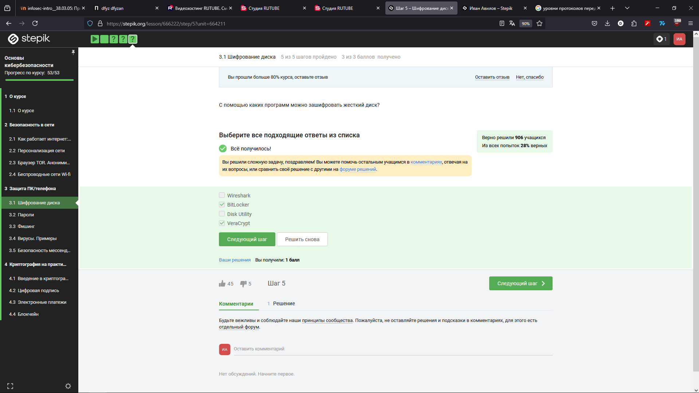

Wireshark - программа для перехвата пакетов, Disk Utility - утилита для просмотра информации про диск

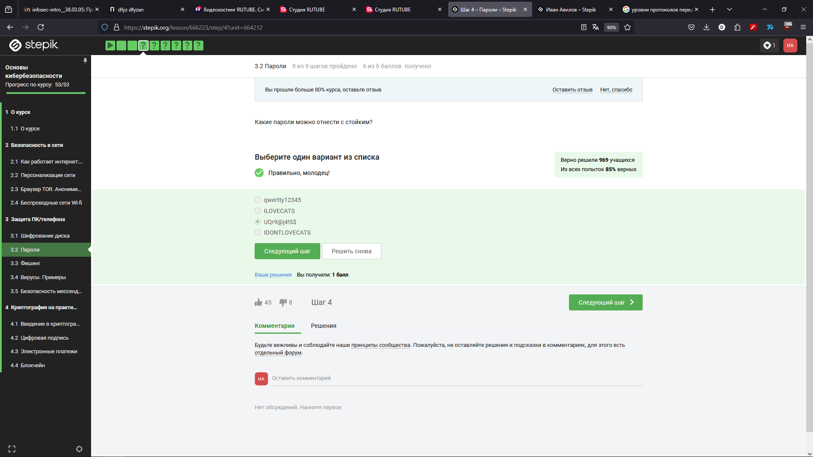

Стойкий пароль должен содержать буквы верхнего и нижнего регистра, цифры и спец символы

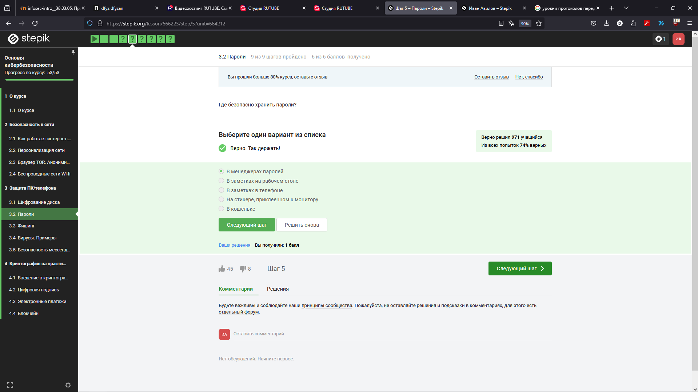

В остальных вариантах пароль легко может быть украден

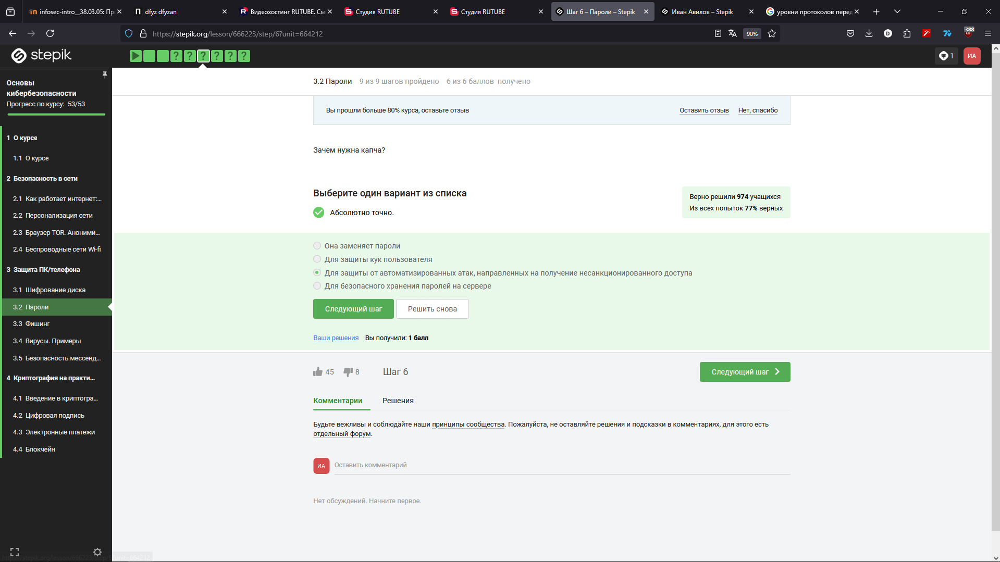

Капча помогает отличить человека от бота

На сервере хранятся хэши паролей

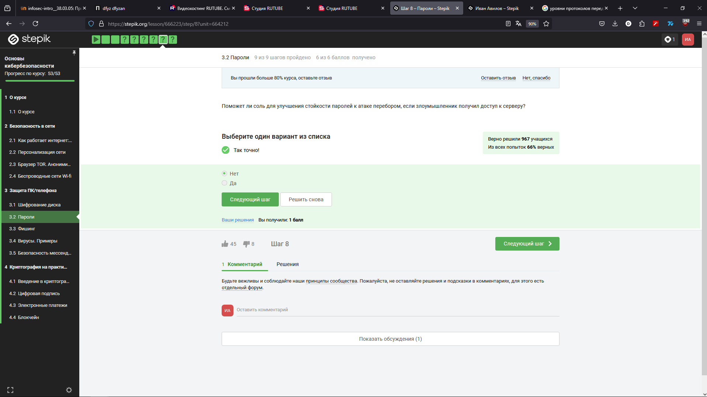

Соль не поможет, если получен доступ к самому серверу

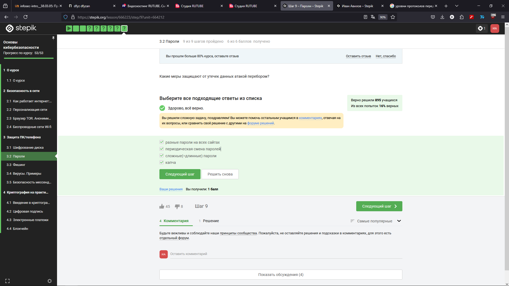

Все эти меры по разному помогают защититься от утечки атакой перебором

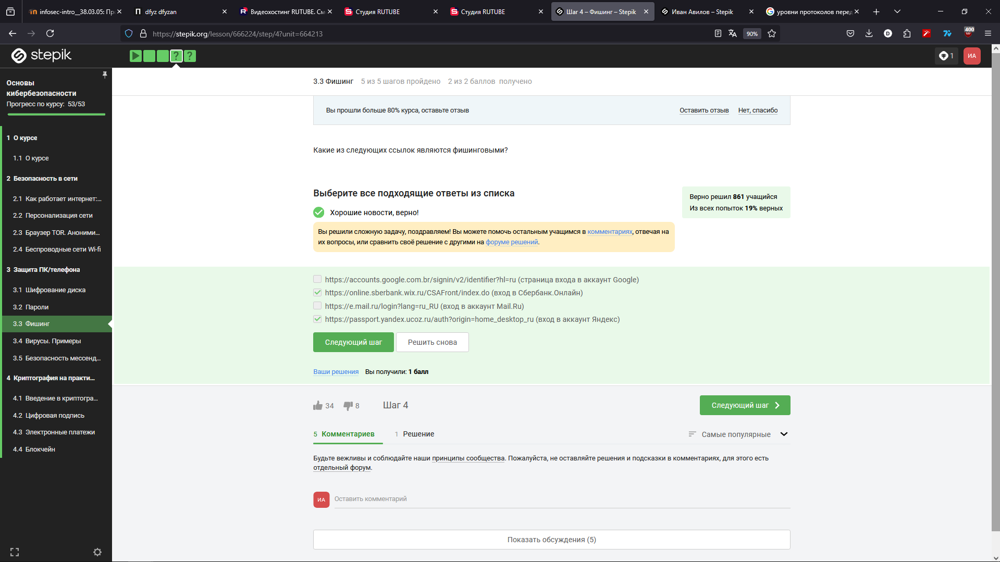

Выбранные ссылки являются фишинговыми, то есть мимикрирующими под легитимные

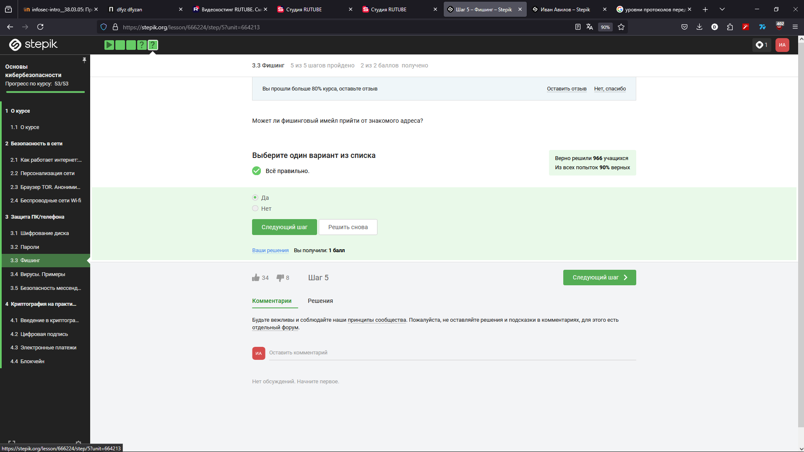

Может, если почта была взломана или адрес подменён

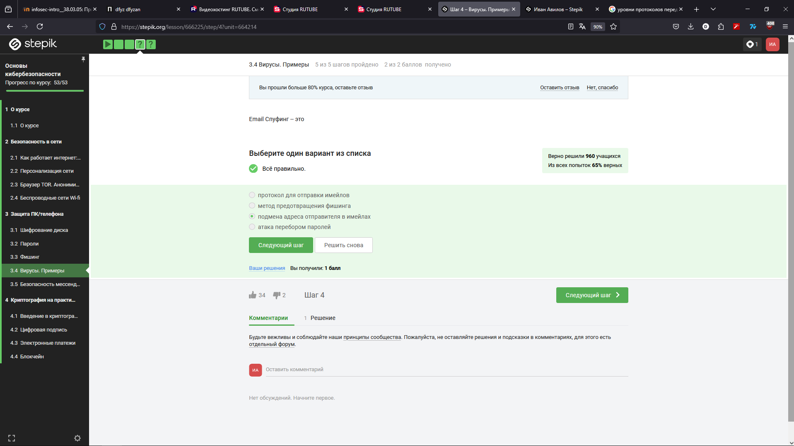

Спуфинг - подмена

Троян несёт своё название от троянского коня

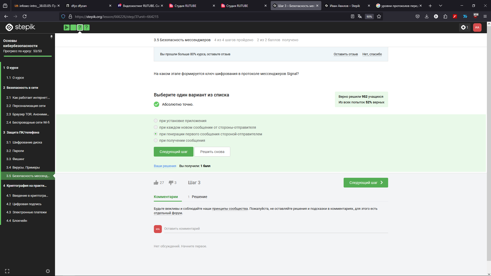

Ключ формируется для одной беседы

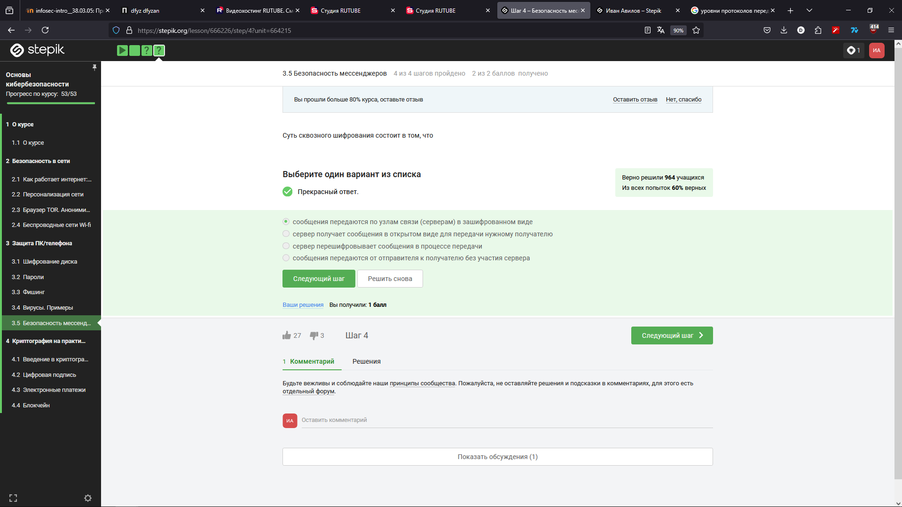

Название идёт от того, что сообщения передаются в зашифрованном виде "насквозь"
